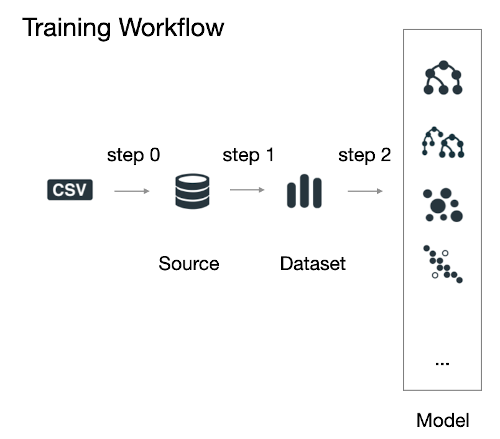
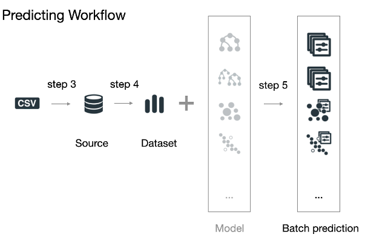

# WhizzML: Training and Predicting Workflows

## The detailed Training Workflow

The basic process to create a model in BigML goes through
several steps. In each step, a new resource is generated.
You can see a sketch of the process in the following image.




### Step 0: uploading your data to create a **Source**

The first step is creating a **Source** by uploading your data.

This means that you'll need to use the **create-source** call
to create a **Source** object. The only mandatory argument
is the path to your data, and the rest of arguments that can be found in the
[API Documentation](https://bigml.com/api/sources) are
optional. As WhizzML is run in the platform, the path to your data
is usually a URL and it should be provided using the `remote` argument.

```
(create-source {"remote" "https://static.bigml.com/csv/iris.csv"})
```

The result of the **create-source**  call is the new **Source** ID.
All the resources in BigML can be identified using a unique resource ID
and the format of this ID for **Sources** would be
**source/** followed by an alphanumeric string
(e.g.: source/4f603fe203ce89bb2d000000).

### Step 1: creating a **Dataset** to serialize the whole data

This will be achieved by using the **create-dataset** call
and the only mandatory argument for this call is the **Source ID** which
points to the **Source** object we want to create the **Dataset** from. The
rest of arguments described in the
[API Documentation](https://bigml.com/api/datasets?id=dataset-arguments)
are optional.

```
;; defining a source-id variable that stores the Source ID
(define source-id "source/4f603fe203ce89bb2d000000")
;; creating the dataset from that source
(create-dataset source-id)
```

The result of the **create-dataset** call is the
corresponding **resource ID** for the dataset
(e.g. dataset/4f603fe203ce89bb2d000004). The dataset
summarizes and serializes the entire set of values that each field contains.

### Step 2: creating your model

The model (cluster, anomaly, etc.) can be created using the configuration
options by default or customizing some values to improve its performance.
As an example, we'll talk about how to create a decision tree and for
that you'll need to use the **create-model** call. The only madatory argument
is the **dataset ID** to start from (in supervised models,
the objective field will be set to the dataset's last field if not
explicitly set). The rest of creation arguments described in the
[API Documentation](https://bigml.com/api/models?id=model-arguments)
are optional. For instance, when
building a classification model you might like to limit the number
of nodes in your decision tree. Also, if the number of instances that belong
to each class in your data is very skewed, you should consider balancing them.
This can be achieved using a **balance_objective** argument, as explained
in the API Documentation. Also, a major attribute to be taken into account
when doing classification or regression is the **objective_field**, which
chooses the field that will be predicted. Any of these properties cannot be
updated. If you want to change them, you'll need to create a new model with
the new configuration.

```
;; defining a dataset-id variable that stores the Dataset ID
(define dataset-id "dataset/4f603fe203ce89bb2d000004")
;; creating a decision tree from that dataset
(create-model dataset-id)
```
The result of a **create-model** call is a **model ID**
(e.g. model/4f603fe203ce89bb2d0000ac).

Any other modeling resource (like clusters, anomaly detectors, etc.)
will also have its particular creation calls (described in their corresponding
101 documents) and configuration
arguments (described in their corresponding API documentation section).
Again, to use a different configuration you'll
need to create a new resource with it.


## The detailed Prediction Workflow

When your model is ready and you want to create predictions for a new bunch
of test data, you will need to run through it your test data file. The
process is sketched in the following image:



As you see, steps 3 and 4 (the equivalent of steps 0 and 1 in the training
workflow) are needed too to create the test dataset,
and in step 5 you create a `batch prediction`
(or `batch centroid`, `batch anomaly score`, etc. depending on the model)
with the results of running the test data through the model and adding its
output to it.

### Step 5: Creating batch predictions

Following the decision tree example, batch predictions can be created
using the **create-batchprediction** call. The mandatory
arguments for the **create-batchprediction** call are the ID of the model
used to predict and the ID of the dataset that contains the test instances that
you want to predict for. The rest of arguments described in the
[API Documentation](https://bigml.com/api/batchpredictions?id=batch-prediction-arguments)
are optional.

```
;; defining a test-dataset-id variable that stores a Dataset ID to be used as input data
(define test-dataset-id "dataset/4f603fe203ce89bb2d000009")
;; defining a model variable that stores the decision tree ID
(define model-id "model/4f603fe203ce89bb2d0000ac")
;; creating a batch prediction by running every instance in the test dataset
;; through the decision tree
(create-batchprediction {"model" model-id
                         "dataset" test-dataset-id})
```
The result of a **create-batchprediction** call is a **batchprediction ID**
(e.g. batchprediction/4f603fe203ce89bb2d0000fd).
